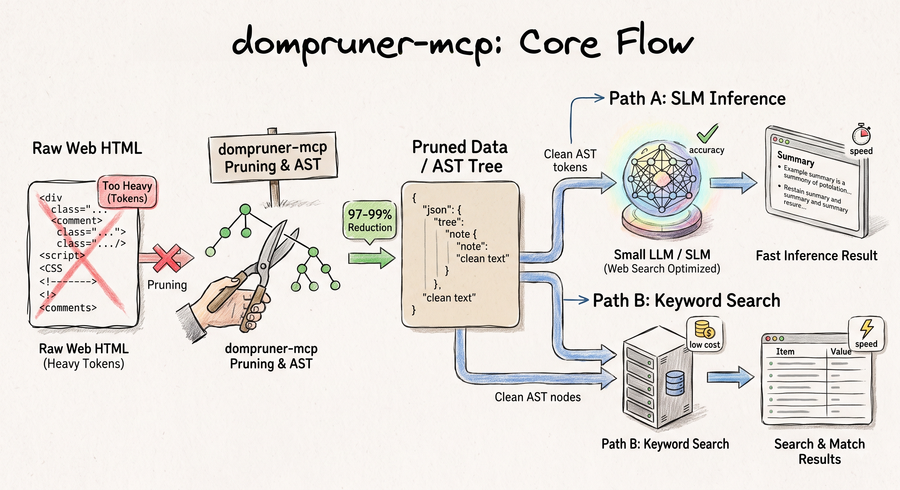

# dompruner-mcp

English | [한국어](./README.ko.md)



> Claude가 페이지를 직접 읽습니다 — 소형 모델 없이, 요약 손실 없이.

Claude의 내장 WebFetch를 사용하면, 소형 모델이 원본 HTML을 전처리하고 요약된 결과를 Claude에게 전달합니다 — 지연, 비용, 그리고 요청하지 않은 해석 레이어가 추가됩니다. DomPruner는 이 단계를 완전히 건너뜁니다: AST 파싱으로 DOM 노이즈(nav, 광고, 스크립트, 푸터)를 제거하고, **원문 콘텐츠를 Claude의 컨텍스트에 직접 전달**합니다.

중간 모델이 페이지를 처리하지 않으므로 요약 오버헤드가 없습니다 — 구조적 핵심만 남긴 실제 텍스트가 그대로 전달됩니다. 결과적으로 **WebFetch 대비 평균 93.5% 컨텍스트 토큰 절감**, API 키, Vector DB, 임베딩 모두 불필요합니다.

```
> [DomPruner] docs.python.org
> | Raw HTML          | 44,316 tokens |
> | DomPruner 정제 후 |  1,328 tokens |
> | 절감              |        97.0%  |
> Fetch: 194ms · Parse: 11.2ms

# WebFetch 컨텍스트: 21,783 tokens → DomPruner: 1,328 tokens (93.9% 절감)
```

**개발자 문서, API 레퍼런스, 릴리즈 노트, 기술 스펙**에 최적화되어 있습니다 — 정확한 문구가 중요하고 요약으로 인한 정밀도 손실이 허용되지 않는 콘텐츠에 적합합니다.

---

## 빠른 시작

설치 없이, API 키 없이:

```bash
npx -y dompruner-mcp
```

### Claude Code

프로젝트 루트의 `.mcp.json`에 추가 (전역 설정은 `~/.claude/.mcp.json`):

```json
{
  "mcpServers": {
    "dompruner": {
      "type": "stdio",
      "command": "npx",
      "args": ["-y", "dompruner-mcp"]
    }
  }
}
```

Claude Code에서 `/mcp`를 실행하면 `dompruner_fetch`와 `dompruner_analyze`가 목록에 나타납니다.

### Claude Desktop

`~/Library/Application Support/Claude/claude_desktop_config.json` (macOS) 또는 `%APPDATA%\Claude\claude_desktop_config.json` (Windows) 수정:

```json
{
  "mcpServers": {
    "dompruner": {
      "command": "npx",
      "args": ["-y", "dompruner-mcp"]
    }
  }
}
```

Claude Desktop을 재시작하면 툴이 자동으로 나타납니다.

### Cursor / Windsurf / 기타 MCP 클라이언트

클라이언트의 MCP 설정 파일(`.cursor/mcp.json` 등)에 동일한 `mcpServers` 블록을 추가:

```json
{
  "mcpServers": {
    "dompruner": {
      "type": "stdio",
      "command": "npx",
      "args": ["-y", "dompruner-mcp"]
    }
  }
}
```

### 환경 변수

| 변수 | 필수 여부 | 설명 |
|------|-----------|------|
| `BRAVE_API_KEY` | 선택 | Brave Search API를 통한 `dompruner_search` 활성화. 미설정 시 DuckDuckGo HTML 스크래핑으로 대체. |

다른 환경 변수는 필요하지 않습니다.

---

## 도구

### `dompruner_fetch`

URL을 가져와 DOM 정제된 Markdown을 반환합니다.

```
dompruner_fetch(url?, query?)
```

| 파라미터 | 타입 | 필수 | 설명 |
|----------|------|------|------|
| `url` | string | 조건부* | 가져올 페이지 URL |
| `query` | string | 선택 | 검색 의도 — BM25+ 섹션 필터링 활성화 |

*`url`을 생략하고 `query`만 제공하면, DomPruner는 MCP 샘플링(`createMessage`)을 통해 호스트 LLM에게 URL 해석을 요청합니다. 클라이언트가 샘플링을 지원하지 않는 경우, LLM이 먼저 검색한 뒤 URL을 찾아 `dompruner_fetch`를 다시 호출하도록 안내합니다.

**응답 형식:**

```
> [DomPruner] fastapi.tiangolo.com
> |           | Tokens |
> |-----------|--------|
> | Raw HTML  | 35,905 |
> | Refined   |  2,011 |
> | Reduction |  94.4% |
> Fetch: 83ms · Parse: 20.7ms

# First Steps

The simplest FastAPI file could look like this:
...
```

### `dompruner_analyze`

전체 페이지 콘텐츠 없이 토큰 절감 리포트와 Semantic Anchor 목록을 반환합니다 — 수집 전 페이지 감사에 유용합니다.

```
dompruner_analyze(url)
```

렌더 타입(SSR / SSG / CSR), 원본 vs 정제 토큰 수, 절감률, 발견된 heading 및 메타 앵커 목록을 보고합니다.

### `dompruner_workflow` 프롬프트

서버는 연결 시 호스트 LLM에 `dompruner_workflow` 프롬프트를 전달하여 올바른 사용 패턴을 주입합니다:

- **URL 알고 있을 때** → `dompruner_fetch(url)` 직접 호출
- **URL 모를 때** → 네이티브 웹 검색으로 URL을 찾은 뒤 `dompruner_fetch(url)` 호출

DomPruner는 콘텐츠 정제를 담당하고, URL 탐색은 호스트 LLM의 역할입니다.

---

## 동작 방식

```
URL
 └─▶ fetchPage()       — 단계적 fetch: 직접 → UA 로테이션 → Playwright 폴백
      │
      ├─▶ [SSG]  extractSsgMarkdown()
      │           __NEXT_DATA__ RSC 트리 탐색 → 클린 Markdown  (≥ 90% 절감)
      │           DOM 파싱 완전 생략
      │
      └─▶ [SSR/CSR]  <script>/<style>/<svg> 사전 제거 (80–92% 크기 감소)
                └─▶ parse5 DOM 트리
                     └─▶ FQN 라우터 (L1)        p / h1–h5 / li / pre / code 유지
                          │                      nav / footer / aside / form 제거
                          └─▶ Heading Cluster (L2)  개발자 문서 구조 탐지
                               └─▶ CETD 엔진 (L3)  텍스트 밀도 점수 폴백
                                    └─▶ BM25+ 섹션 필터  쿼리 인식 랭킹
                                         └─▶ Semantic Anchor  heading 계층 + 메타
                                              └─▶ Compact Markdown  ──▶  LLM 컨텍스트
```

### 렌더 타입 탐지

| 타입 | 신호 | 전략 |
|------|------|------|
| SSG | `__NEXT_DATA__`, `window.__NUXT__`, `window.page` | RSC 트리 탐색 — DOM 파싱 생략 |
| SSR | 본문 텍스트 밀도 ≥ 2% | 전체 DOM AST 파이프라인 (L1→L2→L3) |
| CSR | 본문 텍스트 밀도 < 2% | DOM AST 파이프라인 (부분 콘텐츠) |

### 단계적 Fetch

많은 문서 사이트에서 일반 HTTP 요청이 실패합니다(HTTP 403, UA 차단, JS 게이팅). DomPruner는 포기하기 전 세 단계를 시도합니다:

| 단계 | 트리거 | 방법 |
|------|--------|------|
| L1 | 기본 | 네이티브 `fetch` |
| L2 | 403 / 429 응답 | User-Agent 로테이션 (3종 브라우저 UA) |
| L3 | CSR 감지 또는 L2 실패 | `playwright-core` 헤드리스 브라우저 |

`playwright-core`는 선택적 의존성입니다 — L3가 필요한 경우에만 설치:

```bash
npm install playwright-core
npx playwright install chromium
```

### BM25+ 섹션 필터

`query`가 제공되면 추출된 섹션을 BM25+ 점수로 랭킹합니다. 두 가지 가중치 조정이 적용됩니다:

- **Heading 부스트 (2.5×)** — 관련 heading 아래의 섹션이 더 높게 랭킹되어 사이드바 노이즈 억제
- **깊이 감쇠 (0.4)** — 깊이 중첩된 섹션은 최상위 콘텐츠보다 낮은 점수
- **조상 보존** — 선택된 섹션의 부모 heading은 항상 컨텍스트를 위해 포함

결과: 가장 관련성 높은 섹션만 1,200 토큰 예산 내에서 LLM 컨텍스트에 포함됩니다.

**점수 0 폴백:** 쿼리 용어가 문서 어디에도 없으면(BM25 최고 점수 = 0), DomPruner는 자동으로 BM25 필터 없는 전체 클린 콘텐츠를 반환합니다. 임의의 임계값 없음, 소형 모델 없음 — 의미 추론이 필요한 쿼리에서도 노이즈 제거된 전체 내용(~3,000 토큰)을 그대로 전달하므로 LLM이 직접 추론합니다. 이 케이스는 stats 블록에 태그로 표시됩니다:

```
> [DomPruner] typescriptlang.org  `[BM25: no match → full content]`
> | Raw HTML          | 47,334 |
> | DomPruner 정제 후 |    303 |
> | 절감              |  99.4% |
```

---

## 벤치마크

모든 수치는 Claude 내장 WebFetch 대비 **실측값**입니다. 재현 가능한 스크립트는 [`loadtest/`](./loadtest/)에 있습니다.

**측정 방법:**
- **WebFetch 경로** — `web_fetch_20260209` server tool (Claude가 실제로 사용하는 Anthropic 호스팅 fetch); 컨텍스트 토큰 = API 응답의 `input_tokens`
- **DomPruner 경로** — `dompruner_fetch` → DOM AST 추출 + BM25 섹션 필터; 컨텍스트 토큰 = `refined_tokens`
- **답변 모델** — 두 경로 모두 Claude Haiku 사용 (동일 모델, 공정한 비교)

---

### 1. 컨텍스트 토큰

페이지 fetch 1회당 LLM 컨텍스트 윈도우에 실제로 들어오는 토큰 수.

`†` BM25 점수 0: 쿼리 용어가 문서에 없음 → 전체 클린 콘텐츠 자동 반환 (모델·임계값 없음).

| 사이트 | WebFetch | **DomPruner** | **절감률** | 모드 |
|--------|:--------:|:-------------:|:----------:|:----:|
| Python asyncio | 21,783 | **1,328** | **93.9%** | BM25 |
| Rust Book ch04 | 10,083 | **718** | **92.9%** | BM25 |
| React useState | 12,347 | **1,324** | **89.3%** | BM25 |
| FastAPI Body | 10,903 | **1,229** | **88.7%** | BM25 |
| MDN Fetch API | 15,965 | **1,368** | **91.4%** | BM25 |
| Stripe API | 2,960 | **916** | **69.1%** | BM25 |
| Next.js Routing | 6,263 | **1,215** | **80.6%** | BM25 |
| Wikipedia (LLM) | 56,754 | **679** | **98.8%** | BM25 |
| TypeScript Handbook | 8,729 | **303** | **96.5%** | full† |
| Vue Reactivity | 11,560 | **1,105** | **90.4%** | BM25 |
| **평균** | **15,735** | **1,019** | **93.5%** | |

---

### 2. 답변 품질

사실 조회, 코드 예시, 개념 이해, 의미 불일치, 정보 없음 처리 등 10가지 엣지케이스 쿼리 테스트. Claude Haiku가 각 경로의 출력만 보고 답변하고, 별도의 Haiku 판정자가 질문에 실질적으로 답했는지 평가 (언어 무관).

| 쿼리 유형 | DomPruner | WebFetch | 비고 |
|---|:---:|:---:|---|
| 사실 조회 — `asyncio.create_task` 반환 타입 | ❌ | ✅ | 정보가 페이지 전체에 분산; BM25 1,200 tok 예산 초과 |
| 코드 예시 — FastAPI request body | ✅ | ✅ | |
| 개념 — React state 불변성 이유 | ✅ | ✅ | |
| 의미 폴백 — Vue Proxy 내부 동작 | ✅ | ✅ | BM25 점수 > 0; 올바른 섹션 선택 |
| 깊이 중첩 — TypeScript `infer` 키워드 | ✅ | ✅ | |
| 오류 해결 — CORS `Access-Control-Allow-Origin` | ✅ | ✅ | |
| 목록 완전성 — Stripe Charge 오브젝트 필드 | ✅ | ✅ | |
| 정보 없음 — 페이지 작성자/작성일 | ✅ | ✅ | 두 경로 모두 "내용 없음" 정직하게 응답 |
| 크로스 페이지 — App Router vs Pages Router 비교 | ❌ | ❌ | URL이 App Router만 다룸; 두 경로 모두 데이터 없음 |
| 의미 불일치 — "useState 성능이 좋은가?" | ✅ | ✅ | 모호한 쿼리에도 BM25가 관련 섹션 선택 |
| **결과** | **8 / 10** | **9 / 10** | |

**DomPruner가 불리한 경우:** 정답이 페이지 전체에 분산되어 BM25 토큰 예산(1,200 tok) 안에 모든 관련 섹션이 들어오지 않을 때. `tokenBudget` 옵션으로 예산을 늘리면 대부분 해결됩니다.

**둘 다 실패하는 경우:** 여러 URL의 정보를 비교해야 하는 쿼리 — 단일 URL 미들웨어의 구조적 한계로, DomPruner 고유의 문제가 아닙니다.

---

### 3. 응답 시간

"URL과 질문이 있다" → "답변이 나왔다"까지의 전체 시간.

- DomPruner = `runPipeline` (fetch + parse + BM25) + Haiku 추론 (~1,500 tok 기준)
- WebFetch = `web_fetch` 툴 포함 단일 Haiku 호출 (fetch + ~17,000 tok 추론, 한 번에 처리)

| 쿼리 유형 | DomPruner | WebFetch | 빠름 |
|---|:---:|:---:|:---:|
| 사실 조회 | 1,934 ms | 4,517 ms | **DP −2,583 ms** |
| 코드 예시 | 2,892 ms | 5,876 ms | **DP −2,984 ms** |
| 개념 | 3,220 ms | 6,035 ms | **DP −2,815 ms** |
| 의미 폴백 | 4,943 ms | 6,946 ms | **DP −2,003 ms** |
| 깊이 중첩 | 2,680 ms | 7,083 ms | **DP −4,403 ms** |
| 오류 해결 | 3,762 ms | 6,428 ms | **DP −2,666 ms** |
| 목록 완전성 | 5,097 ms | 5,907 ms | **DP −810 ms** |
| 정보 없음 | 1,856 ms | 3,663 ms | **DP −1,807 ms** |
| 크로스 페이지 | 1,986 ms | 5,478 ms | **DP −3,492 ms** |
| 의미 불일치 | 3,311 ms | 6,180 ms | **DP −2,869 ms** |
| **평균** | **3,168 ms** | **5,811 ms** | **DP −2,643 ms (45% 빠름)** |

10건 전부 DomPruner가 빠릅니다. 격차가 가장 큰 곳은 Wikipedia, Stripe처럼 WebFetch가 대용량 컨텍스트를 당기는 페이지 — 토큰이 많을수록 추론 시간이 늘어나기 때문입니다.

---

### 종합

| 지표 | WebFetch | **DomPruner** |
|---|:---:|:---:|
| 평균 컨텍스트 토큰 | ~15,735 | **~1,019 (93.5% 절감)** |
| 답변 품질 (10건) | 9 / 10 | **8 / 10** |
| 평균 응답 시간 | 5,811 ms | **3,168 ms (45% 빠름)** |
| 콘텐츠 충실도 | 소형 모델 요약 | **원문 그대로 보존** |
| 추가 API 키 / 인프라 | 불필요 | **불필요** |
| SSG 사이트 (Next.js / Nuxt) | DOM 스크래핑 | **RSC 트리 탐색** |
| 의미 쿼리 폴백 | 조용한 품질 저하 | **전체 콘텐츠 자동 전환** |

DomPruner는 품질 1건(정보가 페이지 전체에 분산된 사실 조회)을 양보하는 대신 **93.5% 토큰 절감과 45% 빠른 응답**을 제공합니다. 세션당 여러 번 웹 fetch를 수행하는 에이전트 워크플로우에서 절감 효과는 누적됩니다.

---

## 아키텍처

```
src/
  mcp-server.ts          — MCP stdio 전송 + 툴/프롬프트 핸들러
  pipeline.ts            — 오케스트레이터: fetch → parse → extract → rules → serialize
                           5분 TTL URL 캐시 포함
  ast/
    fetcher.ts           — 단계적 HTTP fetch (네이티브 → UA 로테이션 → Playwright)
    parser.ts            — 사전 제거(<script>/<style>/<svg>) + parse5 DOM 빌더
    core-extractor.ts    — L1→L2→L3 추출 캐스케이드
    fqn-router.ts        — L1: FQN 시맨틱 셀렉터 매칭 + 노이즈 제거
    heading-cluster.ts   — L2: 개발자 문서용 heading-block 클러스터링
    cetd.ts              — L3: 콘텐츠/태그 밀도 점수 폴백
    ssg-extractor.ts     — Next.js / Nuxt / Gatsby __NEXT_DATA__ RSC 트리 탐색
    anchor.ts            — Semantic Anchor 추출 (title, meta description, h1–h3)
  middleware/
    serializer.ts        — FQNNode[] → Compact Markdown + 토큰 추정기
  rule-engine/
    registry.ts          — URL 패턴 → Rule 세트 해석 및 체이닝
    types.ts             — Rule 인터페이스 정의
    builtin/
      section-bm25.ts    — BM25+ (heading 부스트 + 조상 보존)
      http-endpoint.ts   — HTTP 메서드/경로/응답 블록 재포맷터
      code-signature.ts  — 코드 블록 함수/클래스 시그니처 추출기
```

---

## 개발

```bash
git clone https://github.com/dong7812/dompruner-mcp.git
cd dompruner-mcp
npm install
npm run dev    # tsx watch — 빌드 단계 불필요
npm run build  # tsc → dist/
```

로컬 툴 호출 테스트:

```bash
echo '{"jsonrpc":"2.0","id":1,"method":"tools/call","params":{"name":"dompruner_fetch","arguments":{"url":"https://fastapi.tiangolo.com","query":"routing"}}}' \
  | npm run dev 2>/dev/null
```

---

## 로드맵

- [#1](https://github.com/dong7812/dompruner-mcp/issues/1) — Content-Type 라우팅을 통한 PDF & Office 파일 추출
- [#2](https://github.com/dong7812/dompruner-mcp/issues/2) — `dompruner_crawl` MCP 툴 + sitemap.xml 지원을 통한 BFS 사이트 크롤
- [#3](https://github.com/dong7812/dompruner-mcp/issues/3) — 이미지 콘텐츠 추출 (로컬 OCR / 선택적 VLM 캡셔닝)
- [#4](https://github.com/dong7812/dompruner-mcp/issues/4) — 구조화된 JSON 출력 모드 (결정론적 HTML 추출 + 선택적 LLM 스키마)

---

## 라이선스

MIT
